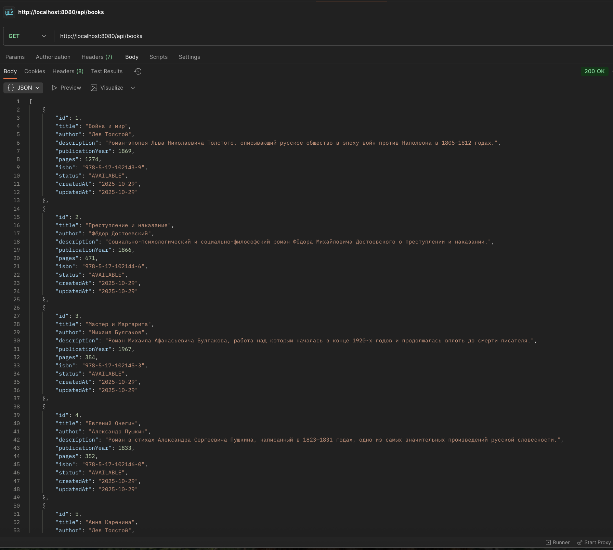
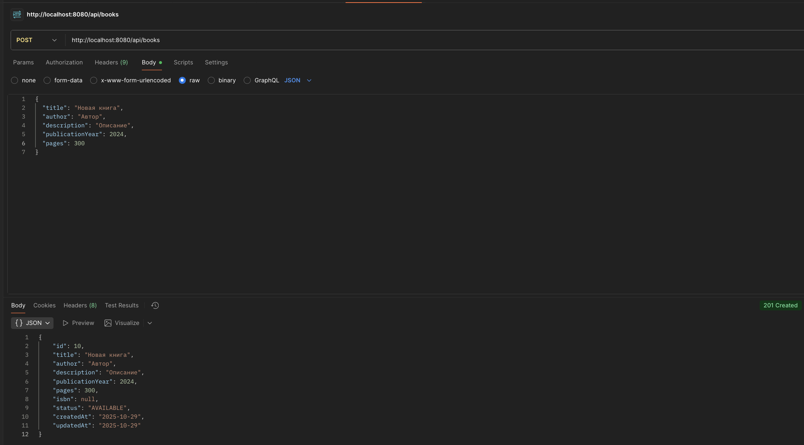
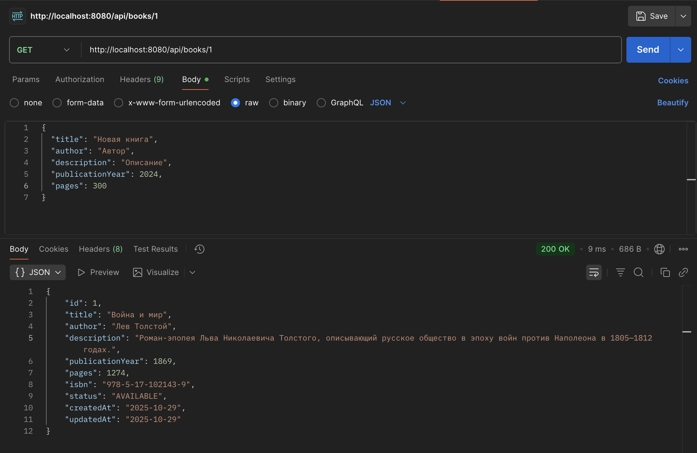
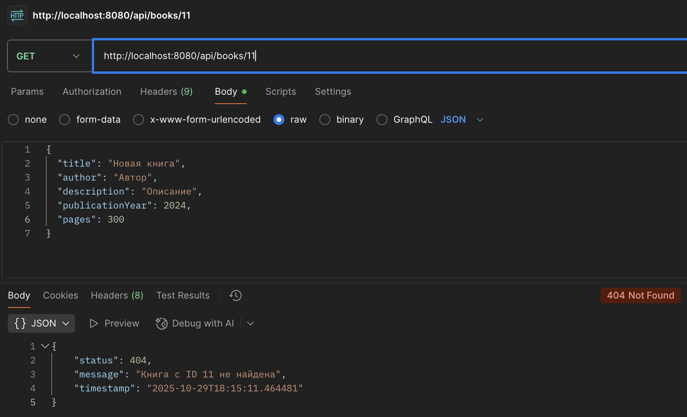
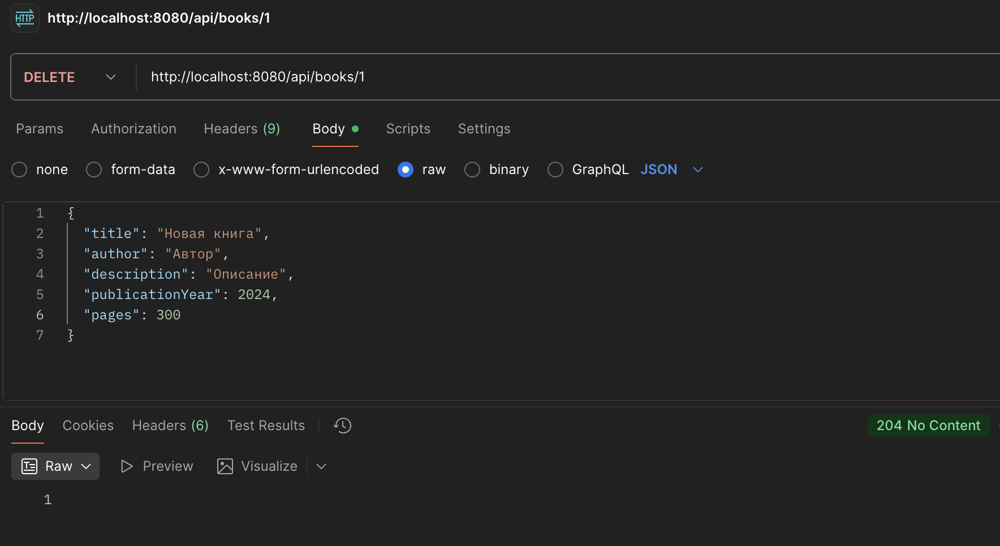
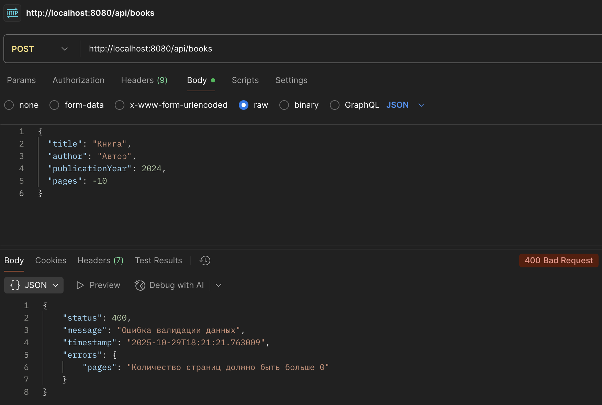

# Books Management System

## Скриншоты рабочих API

- GET `/api/books` (200):
  
  

- POST `/api/books` (201):
  
  

- GET `/api/books/{id}` (200/404):
  
  
  
  

- PUT `/api/books/{id}` (200):
  
  

- DELETE `/api/books/{id}` (204):
  
  

- POST `/api/books` c невалидными данными (400):
  
  

## Технологии

- **Java 21**
- **Spring Boot 3.5.7**
- **Spring Data JPA**
- **H2 Database** (для разработки)
- **PostgreSQL** (для продакшена)
- **Maven**

## Структура проекта

```
src/main/java/com/example/books/
├── BooksApplication.java          # Главный класс приложения
├── controller/                    # REST контроллеры
│   ├── BookController.java       # API для работы с книгами
│   └── DataController.java       # API для управления данными
├── service/                      # Бизнес-логика
│   └── BookService.java         # Сервис для работы с книгами
├── repository/                   # Слой доступа к данным
│   └── BookRepository.java      # Репозиторий для работы с БД
├── model/                       # Модели данных
│   ├── Book.java               # Сущность книги
│   └── BookStatus.java         # Статусы книг
├── dto/                        # Data Transfer Objects
│   ├── BookDto.java           # DTO для книги
│   └── CreateBookDto.java     # DTO для создания книги
└── exception/                  # Обработка исключений
    ├── BookNotFoundException.java
    ├── BookAlreadyExistsException.java
    └── GlobalExceptionHandler.java
```

## Конфигурация базы данных

Приложение настроено для работы с двумя типами БД:

### H2 Database (по умолчанию)
- URL: `jdbc:h2:mem:testdb`
- Консоль: http://localhost:8080/h2-console
- Логин: `sa`, Пароль: `password`

### PostgreSQL
Раскомментируйте соответствующие строки в `application.yml`:
```yaml
datasource:
  url: jdbc:postgresql://localhost:5432/books_db
  driver-class-name: org.postgresql.Driver
  username: postgres
  password: password
```

## API Endpoints

### Основные операции с книгами

| Метод | URL | Описание |
|-------|-----|----------|
| GET | `/api/books` | Получить все книги |
| GET | `/api/books/paginated` | Получить все книги с пагинацией |
| GET | `/api/books/{id}` | Получить книгу по ID |
| POST | `/api/books` | Создать новую книгу |
| PUT | `/api/books/{id}` | Обновить книгу |
| DELETE | `/api/books/{id}` | Удалить книгу |

### Поиск и фильтрация

| Метод | URL | Описание |
|-------|-----|----------|
| GET | `/api/books/search/title?title={title}` | Поиск по названию |
| GET | `/api/books/search/author?author={author}` | Поиск по автору |
| GET | `/api/books/search?keyword={keyword}` | Поиск по ключевым словам |
| GET | `/api/books/status/{status}` | Фильтр по статусу |
| GET | `/api/books/available` | Получить доступные книги |

### Дополнительные операции

| Метод | URL | Описание |
|-------|-----|----------|
| PATCH | `/api/books/{id}/status?status={status}` | Изменить статус книги |
| GET | `/api/books/statistics` | Получить статистику |
| GET | `/api/books/statuses` | Получить все статусы |

### Управление данными

| Метод | URL | Описание |
|-------|-----|----------|
| POST | `/api/data/init` | Инициализировать тестовые данные |
| DELETE | `/api/data/clear` | Очистить все данные |

## Статусы книг

- `AVAILABLE` - Доступна
- `BORROWED` - Взята
- `RESERVED` - Зарезервирована
- `MAINTENANCE` - На обслуживании

## Примеры запросов

### Создание книги
```bash
curl -X POST http://localhost:8080/api/books \
  -H "Content-Type: application/json" \
  -d '{
    "title": "Война и мир",
    "author": "Лев Толстой",
    "description": "Роман-эпопея",
    "publicationYear": 1869,
    "pages": 1274,
    "isbn": "978-5-17-102143-9"
  }'
```

### Поиск по названию
```bash
curl "http://localhost:8080/api/books/search/title?title=война"
```

### Изменение статуса
```bash
curl -X PATCH "http://localhost:8080/api/books/1/status?status=BORROWED"
```

### Инициализация тестовых данных
```bash
curl -X POST http://localhost:8080/api/data/init
```

## Запуск приложения

1. Клонируйте репозиторий
2. Убедитесь, что у вас установлен Java 21
3. Запустите приложение:
   ```bash
   ./mvnw spring-boot:run
   ```
4. Приложение будет доступно по адресу: http://localhost:8080

## Тестирование

Для тестирования API можно использовать:
- **Postman**
- **curl**
- **Swagger UI** (если добавить зависимость springdoc-openapi)

## Особенности

- Валидация входных данных
- Глобальная обработка исключений
- Поддержка пагинации
- Поиск без учета регистра
- Автоматическое обновление времени изменения
- Уникальность ISBN
- Подробное логирование SQL запросов
